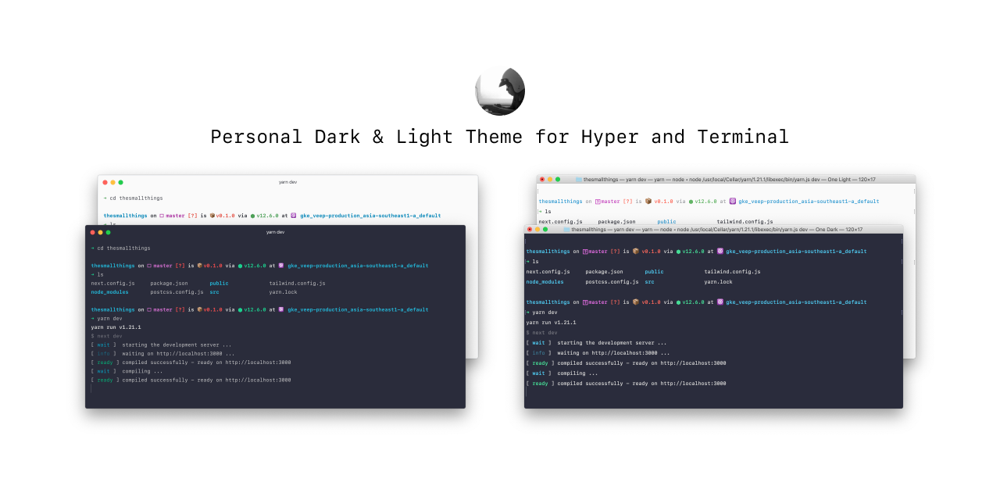
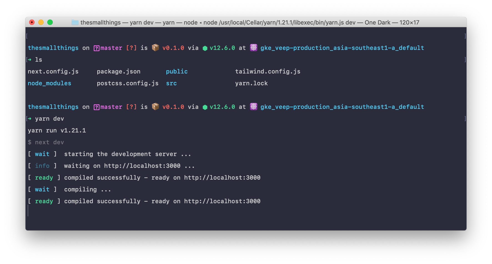
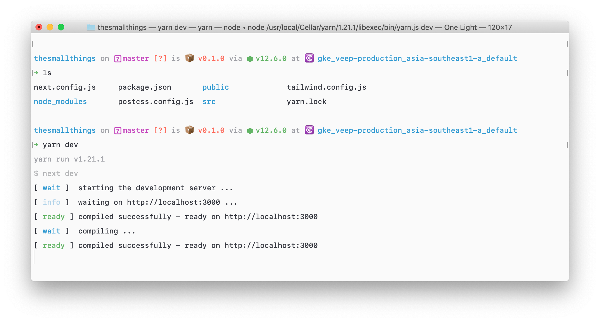
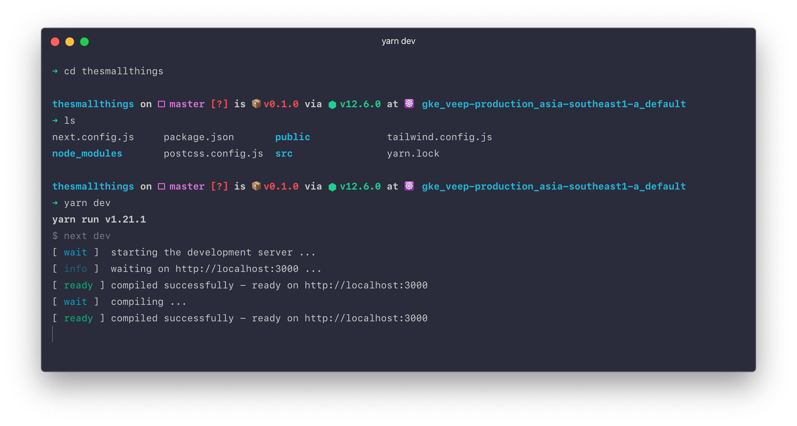
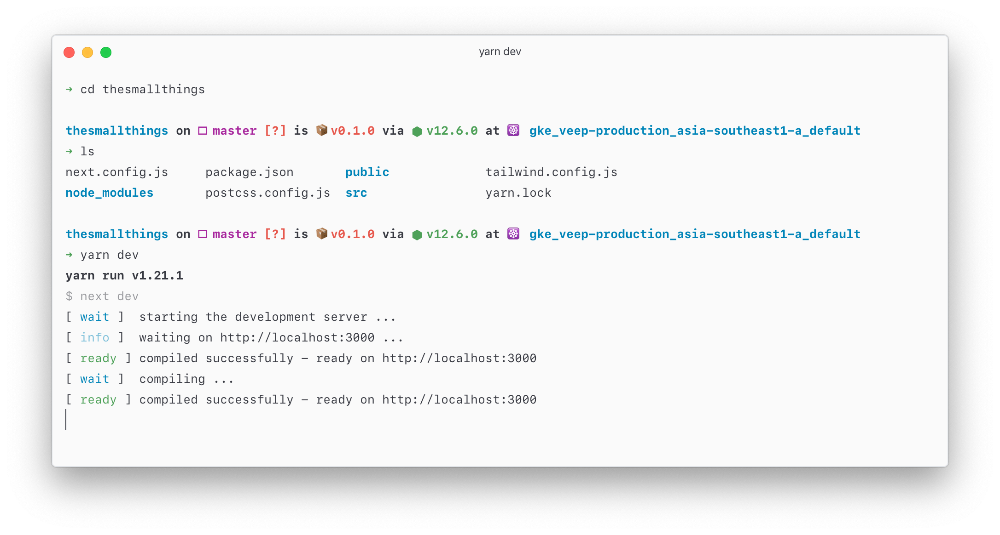

This is the opinionated configuration for theming Hyper and Terminal on Mac OS.

## What plugins do you use?

1. Shell: ["Oh My ZSH!"](https://ohmyz.sh/)
2. ZSH Theme: [Spaceship](https://github.com/denysdovhan/spaceship-prompt)
3. Font Family: SF Mono ❤️
4. Hyper plugins:
   1. [hyper-pane](https://hyper.is/plugins/hyper-pane): No need to open new terminal tab anymore
   2. [hyper-search](https://hyper.is/plugins/hyper-search): Rarely use, [but I do some help on styling for it](https://github.com/jaanauati/hyper-search/pull/67)

## Preview

Mac OS Terminal with Dark theme

Mac OS Terminal with Light theme

Hyper with Dark theme

Hyper with Light theme
